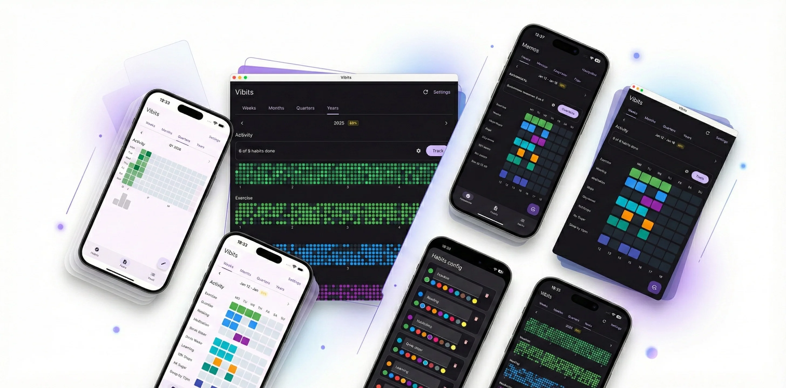

# Vibits

Habit tracker powered by [Memos](https://github.com/usememos/memos). Built with Kotlin Multiplatform + Compose Multiplatform.

## Modules

- `shared/` - UI, networking, models, DI, platform abstractions.
- `androidApp/` - Android launcher.
- `desktopApp/` - Desktop launcher.
- `iosApp/` - iOS wrapper (XCFramework).
- `webApp/` - Web entry (Wasm).

## Run

- Desktop: `./gradlew :desktopApp:run`
- Android: `./gradlew :androidApp:installDebug`
- Web: `./gradlew :webApp:wasmJsBrowserDevelopmentRun`
- iOS XCFramework: `./gradlew :shared:assembleSharedDebugXCFramework`
- Desktop DMG: `./gradlew :desktopApp:packageDmg -Dorg.gradle.java.home=$(/usr/libexec/java_home -v 21)`
- DMG output: `desktopApp/build/compose/binaries/main/dmg/Vibits-1.0.0.dmg`

## Tests

We use TDD for business logic and target high coverage.

- Unit tests: `shared/src/commonTest`
- Test naming: backticks with `when ... then ...`
- Run tests: `./gradlew :shared:desktopTest`
- Coverage: `./gradlew :shared:jacocoDesktopTestReport`
- Coverage report: `shared/build/reports/jacoco/jacocoDesktopTestReport/html/index.html`
