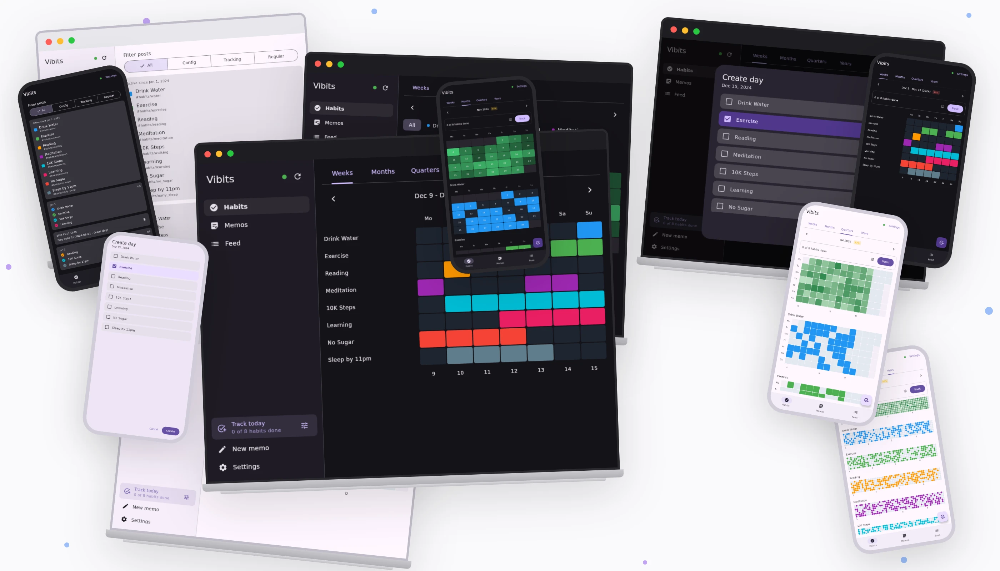

# Vibits

[](https://github.com/be1ski/vibits/actions/workflows/ci.yml)
[](https://codecov.io/gh/be1ski/vibits)
[](https://github.com/be1ski/vibits/releases/latest)
[](https://be1ski.github.io/vibits/)



Habit tracker powered by [Memos](https://github.com/usememos/memos). Kotlin Multiplatform + Compose Multiplatform.

**Platforms:** Android · iOS · Desktop · Web<br>
**Modes:** Online (Memos sync) · Offline · Demo<br>
**Localization:** 🇬🇧 🇪🇸 🇨🇳 🇮🇳 🇸🇦 🇧🇷 🇷🇺 🇺🇦 🇧🇾 🇰🇿 🇺🇿 🇬🇪 🇦🇿 🇰🇬 🇹🇯 🇷🇴 🇹🇲 🇯🇵 🇩🇪 🇫🇷

## Run

```
./gradlew :desktopApp:run
./gradlew :androidApp:installDebug
./gradlew :webApp:wasmJsBrowserDevelopmentRun
```

## Build

```
./gradlew checkAll                                   # lint, detekt, compile, tests (macOS)
./gradlew checkJvm                                   # JVM checks only (Linux)
./gradlew koverXmlReport                             # coverage report
./gradlew :androidApp:assembleRelease                # Android APK
./gradlew :iosApp:framework:assembleSharedReleaseXCFramework  # iOS framework
./gradlew :desktopApp:packageDmg                     # macOS DMG
./gradlew :desktopApp:packageMsi                     # Windows MSI
```

## CI/CD

[One-click release](https://github.com/be1ski/vibits/actions/workflows/release.yml) → builds all platforms in parallel:
- **Android APK** → GitHub Releases + Firebase App Distribution
- **macOS DMG / Windows MSI** → GitHub Releases
- **Web** → GitHub Releases + GitHub Pages

## Structure

```
core/       — shared infrastructure (TEA, UI, strings, platform)
feature/    — feature modules
androidApp/ — Android entry point
desktopApp/ — Desktop entry point
iosApp/     — iOS entry point (Xcode app + framework)
webApp/     — Web entry point (WASM)
```

## Architecture

TEA (The Elm Architecture) · ~95% shared code
